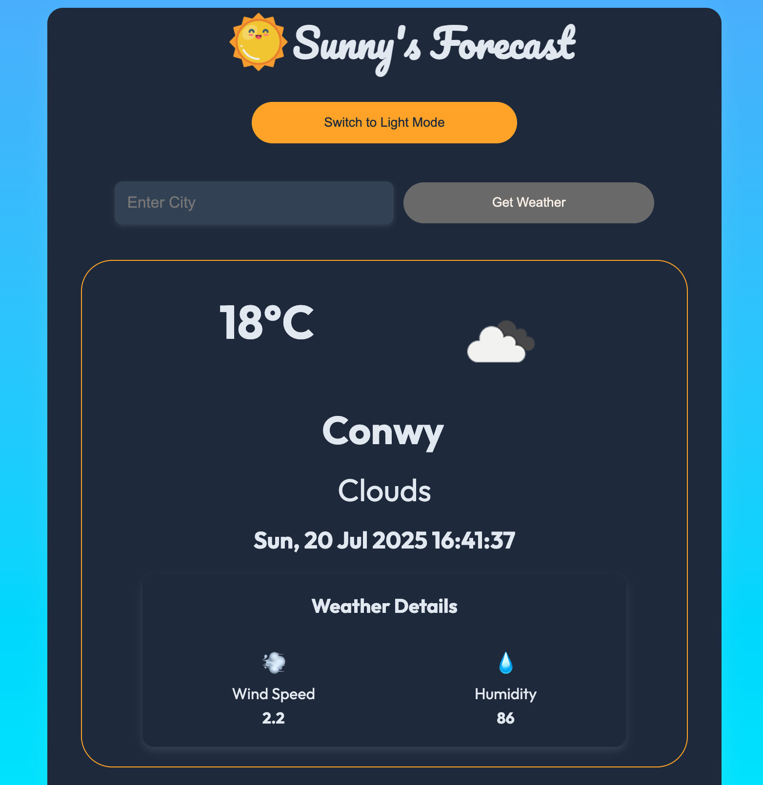
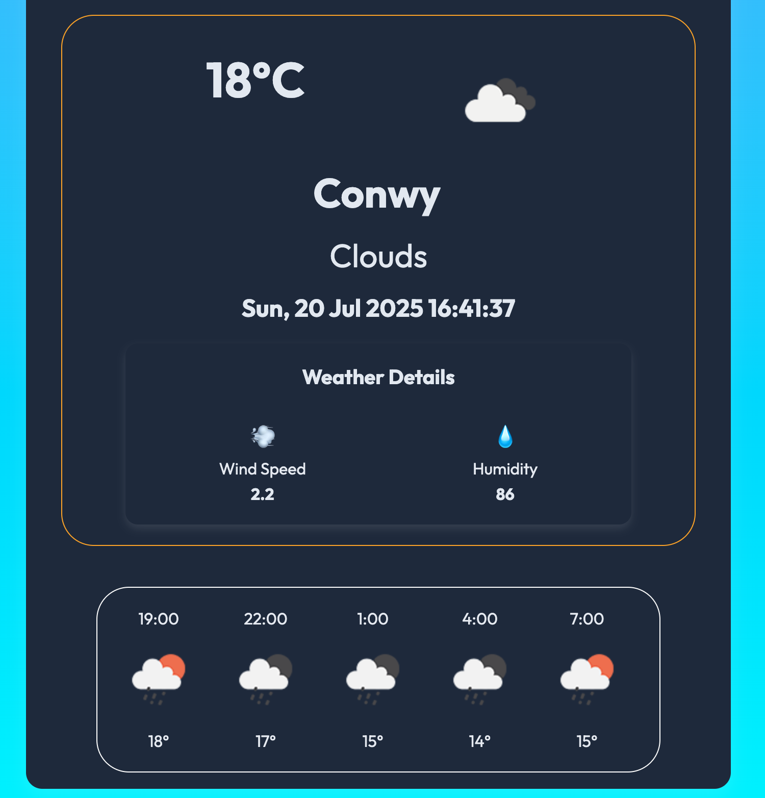

# React Weather App

## Table of contents

- [Overview](#overview)
  - [The challenge](#the-challenge)
  - [Screenshot](#screenshot)
  - [Links](#links)
- [My process](#my-process)
  - [Built with](#built-with)
  - [Skills](#skills)
  - [Continued development](#continued-development)
  - [Useful resources](#useful-resources)

## Overview

This is a weather app built with React19 and Vite. 

### The challenge

Users should be able to:

- Saving the weather data in context
- Search weather details according to the city
- Current forecast and next 24 hours available
- Responsive for every screen size.
- Dark mode toggle

### Screenshot



### Links

- Solution URL: (https://github.com/LaurenAMolloy/React-Weather-App)
- Live Site URL: (https://react-weather-app-nled.onrender.com)

### Built with

- React
- Vite
- JavaScript
- Semantic HTML5 markup
- Flexbox
- Visual Studio Code

### Skills 

I have practiced many skills and concepts during the build of this project. I utilised React hooks and concepts such as custom hooks, useContext, useEffect and useState.

### Continued development

Moving forward I would like to continue learning about reusability, further my understanding of React Router and create more MPA's.

### Useful resources

- [Open Weather API ](https://openweathermap.org/) - This is the open weather API.


## Getting Started

### Prerequisites

- NPM 

### Setup


The project repository can be found in [GitHub link](https://github.com/LaurenAMolloy/React-Weather-App) or just clone the project using this command. 


```
Using HTTPS

# git clone  https://github.com/LaurenAMolloy/React-Weather-App.git
```

+ Open terminal on your workspace with

```
cd /home/workspace/React-Weather-App
```

## Install

Install NPM

Check that you have node and npm installed

To check if you have Node.js installed, run this command in your terminal:

```
node -v
```

To confirm that you have npm installed you can run this command in your terminal:

```
npm -v
```

To install all the dependences of the project, run the following command:

```
npm install
```

To run the application, run the following command:

```
npm run dev
```

